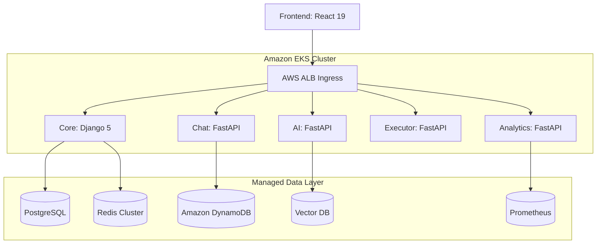

# 🏰 CLASHCODE


**CLASHCODE** is an industrial-grade, gamified coding platform designed for competitive programming, mastery-based progression, and AI-assisted tutoring. 

Engineered with a "Clinical Architect" philosophy, the platform leverages distributed microservices, zero-layout-shift UI systems, and secure containerized code execution.

---

## 🏗️ System Architecture

CLASHCODE is orchestrated on **Amazon EKS (Kubernetes)**, utilizing a high-performance network topology managed by **AWS Application Load Balancer (ALB)**.



---

## 📂 Services Ecosystem

| Service | Technology | Primary Function |
|---|---|---|
| **[Frontend](frontend/)** | React 19, Vite, Zustand | The Code Arena UI. Implements ZLS (Zero Layout Shift) loading, animated auth flows, and Monaco editor integration. |
| **[Core API](services/core/)** | Django 5, DRF, Celery | The backbone. Handles Authentication, Profiles, Gamification (XP), Payments (Razorpay), and Level orchestration. |
| **[Chat Service](services/chat/)** | FastAPI, WebSockets | Real-time global messaging and presence tracking. Features persistent history in DynamoDB and Redis-backed session management. |
| **[AI Tutor](services/ai/)** | FastAPI, LangChain | RAG-based AI assistant providing contextual hints and code analysis via vector retrieval. |
| **[Executor](services/executor/)** | FastAPI, Docker SDK | Secure code evaluator. Supports host-level fallback and strict Docker containerization for untrusted user code. |
| **[Analytics](services/analytics/)** | FastAPI, Prometheus | Monitors cluster health and proxies real-time system metrics (CPU/Memory) to the admin dashboard. |

---

## 🛠️ Core Technical Pillars

1.  **Elastic Infrastructure**: Fully containerized deployment on EKS with automated scaling, horizontal pod autoscaling (HPA), and managed node groups.
2.  **Persistent Real-time Chat**: WebSocket-based communication with message persistence in DynamoDB, ensuring zero message loss even during service restarts.
3.  **Sandboxed Execution Engine**: Python code submitted by users is pre-validated via AST constraints and then evaluated inside ephemeral, network-isolated containers.
4.  **Clinical Frontend Architecture**: Built on React 19. Utilizes a skeleton-first approach to guarantee zero-layout-shift (ZLS) loading states and Framer Motion for premium micro-animations.
5.  **Secrets & IAM Management**: Leverages `external-secrets.io` for AWS Secrets Manager integration and IAM Roles for Service Accounts (IRSA) for fine-grained resource access.

---

## 🚀 Deployment & Operations

### Production (AWS EKS)
The infrastructure is managed via Kubernetes manifests located in `infra/k8s/`.

1.  **Secrets Management**:
    Deploy the ExternalSecret resources to sync with AWS Secrets Manager:
    ```bash
    kubectl apply -f infra/k8s/base/external-secrets.yaml
    ```

2.  **Service Rollout**:
    ```bash
    kubectl apply -k infra/k8s/overlays/prod/
    ```

### Local Development (Docker Compose)
For local testing, a standard compose file is provided in `services/`.

```bash
docker compose -f services/docker-compose.yml up -d --build
```

---

## 🔒 Security Posture

*   **Execution Sandboxing**: Untrusted code is executed without network access using non-root users inside disposable containers. 
*   **Infrastructure Isolation**: Databases and internal services are located in private subnets, accessible only via the ALB Ingress or VPN.
*   **Token Security**: Implements strict JWT Refresh Token Rotation and Redis-backed blacklisting for session revocation.
*   **Audit Logging**: Every code execution and point transaction (XP) is logged to an immutable audit trail.

---

## 📄 License

This project is licensed under the MIT License.
