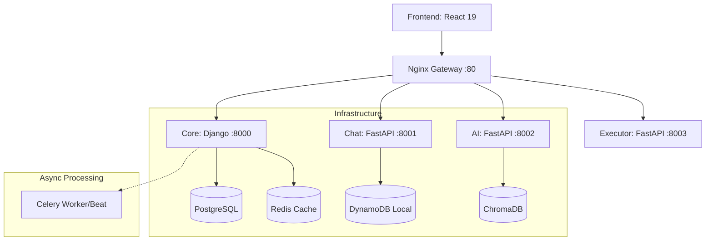

# 🏰 CLASHCODE


**CLASHCODE** is an industrial-grade, gamified coding platform designed for competitive programming, mastery-based progression, and AI-assisted tutoring.

Engineered with a "Clinical Architect" philosophy, the platform utilizes strict Service-View separation, zero-layout-shift UI systems, and secure containerized code execution.

---

## 🏗️ System Architecture

CLASHCODE is built on a scalable, language-agnostic microservices architecture orchestrated by Docker Compose and reverse-proxied by Nginx.



### ⚙️ Core Technical Pillars

1.  **Strict Service-View Split**: The Django Core acts purely as a presentation layer via `views.py` controllers, delegating all database transactions, API requests, and business logic to isolated `services.py` modules.
2.  **Sandboxed Execution Engine**: Python code submitted by users is pre-validated via AST constraints and then evaluated inside ephemeral, network-isolated Docker containers to prevent malicious host breakouts.
3.  **Ledger-Grade Audit Trails**: Systems like `xpoint` (XP Management) and `authentication` utilize immutable transaction logs to track every point earned and every sensitive account action.
4.  **Data-Driven Level Management**: Challenges and progression logic are decoupled from code, stored as Markdown/YAML files in `challenges/content/`, and seamlessly loaded into PostgreSQL via custom management commands.
5.  **Clinical Frontend Architecture**: Built on React 19 and Vite. Utilizes the automated `boneyard-js` skeleton framework to guarantee zero-layout-shift (ZLS) loading states and Framer Motion for premium micro-animations.

---

## 📂 Services Overview

| Service | Technology | Primary Function |
|---|---|---|
| **[Frontend](frontend/)** | React 19, Zustand, Tailwind | The Code Arena UI. Implements ZLS loading, animated auth flows, and Monaco editor integration. |
| **[Core API](services/core/)** | Django 5, DRF, Celery | The backbone. Handles Authentication, Profiles, the Store, Payments (Razorpay), and Level orchestration. |
| **[Chat Service](services/chat/)** | FastAPI, WebSockets | Highly concurrent real-time messaging, presence tracking, and DynamoDB message persistence. |
| **[AI Tutor](services/ai/)** | FastAPI, LangChain | RAG-based AI assistant providing contextual hints and code analysis via ChromaDB vector retrieval. |
| **[Executor](services/executor/)** | FastAPI, Docker SDK | The secure code evaluator. Supports host-level fallback and strict Docker containerization. |

---

## 🚀 Deployment (Production-First)

CLASHCODE is designed to run in a highly isolated Docker environment. Only the Nginx Gateway exposes a public port. Databases and internal services communicate strictly via Docker's private bridge network.

### 1. Environment Configuration

Copy the example environment files and replace placeholders with your production credentials (e.g., `SECRET_KEY`, JWT keys, Razorpay keys, Firebase Admin credentials).

```bash
cp services/.env.example services/.env
cp services/core/.env.example services/core/.env
cp services/chat/.env.example services/chat/.env
cp services/ai/.env.example services/ai/.env
```

### 2. Launch the Stack

Initialize the entire platform, including building all custom microservice images:

```bash
docker compose -f services/docker-compose.yml up -d --build
```

The platform is now securely accessible via your configured `NGINX_HTTP_PORT` (default: `http://localhost`).

### 3. Local UI Development

For frontend development against a running production backend:

```bash
cd frontend
npm install
npm run dev
```

*(Note: Ensure `VITE_API_URL` correctly points to your backend gateway).*

---

## 🔒 Security Posture

*   **Token Rotation**: Implements strict JWT Refresh Token Rotation and Redis-backed blacklisting.
*   **Execution Sandboxing**: Untrusted code is executed without network access using non-root users inside disposable containers. gVisor (`runsc`) support is available for hardened kernel-level isolation.
*   **Infrastructure Obfuscation**: Databases (Postgres, Redis, Chroma) are completely inaccessible from the host machine.

---

## 📄 License

This project is licensed under the MIT License.
